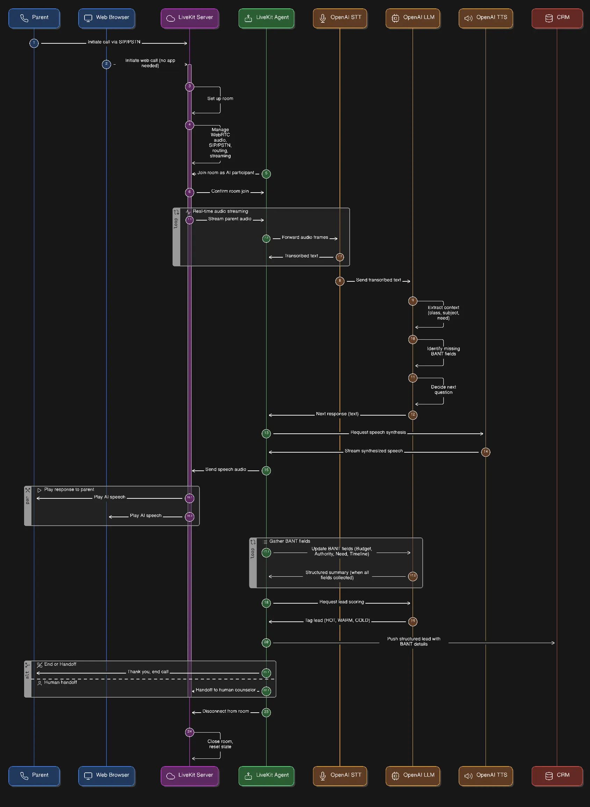

# Sales Voice Agent

A real-time voice AI agent for EdTech sales conversations. This application uses LiveKit and OpenAI's Realtime API to conduct natural voice conversations with parents, collecting BANT (Budget, Authority, Need, Timeline) qualification information for student enrollment.

## Features

- 🎙️ **Real-time Voice Conversations**: Powered by LiveKit and OpenAI's Realtime API
- 🤖 **AI-Powered Agent**: Conversational AI agent that conducts natural sales conversations
- 📋 **BANT Qualification**: Systematically collects Budget, Authority, Need, and Timeline information
- 📞 **Lead Capture**: Automatically captures and stores lead information
- 🔐 **Secure Token Management**: Generate access tokens for LiveKit rooms
- 📊 **Usage Metrics**: Tracks LLM token usage and conversation metrics
- 🆔 **Conversation Tracking**: Unique conversation IDs for each interaction

## Prerequisites

- Python 3.8 or higher
- LiveKit server (cloud or self-hosted)
- OpenAI API key with access to Realtime API
- Environment variables configured (see Configuration section)

## Installation

1. Clone the repository:
```bash
git clone <repository-url>
cd sales_voice_agent
```

2. Install dependencies:
```bash
pip install -r requirements.txt
```

3. Set up environment variables (see Configuration section)

## Configuration

Create a `.env` file in the project root with the following variables:

```env
LIVEKIT_URL=wss://your-livekit-server.com
LIVEKIT_API_KEY=your-api-key
LIVEKIT_API_SECRET=your-api-secret
OPENAI_API_KEY=your-openai-api-key
```

### Environment Variables

- `LIVEKIT_URL`: Your LiveKit server WebSocket URL
- `LIVEKIT_API_KEY`: LiveKit API key for authentication
- `LIVEKIT_API_SECRET`: LiveKit API secret for token generation
- `OPENAI_API_KEY`: OpenAI API key for Realtime API access

## Usage

### Running the Agent

Start the LiveKit agent worker:

```bash
python main.py dev
```

The agent will connect to LiveKit and wait for incoming voice calls.

### Generating Access Tokens

Use the token generator script to create access tokens for clients and agents:

#### Generate a client token:
```bash
python generate_token.py client --room "sales-room-123" --identity "parent-9876543210"
```

#### Generate an agent token:
```bash
python generate_token.py agent --room "sales-room-123"
```

#### Generate a custom token:
```bash
python generate_token.py custom --room "sales-room-123" --identity "user-123" --name "John Doe"
```

#### Output as JSON:
```bash
python generate_token.py client --room "sales-room-123" --identity "parent-123" --json
```

## Project Structure

```
sales_voice_agent/
├── agent/
│   ├── __init__.py
│   ├── bant_agent.py      # Main agent class
│   ├── prompt.py          # System prompts and instructions
│   └── tools.py           # Agent tools (submit_lead)
├── config/
│   ├── __init__.py
│   ├── settings.py        # Environment configuration
│   └── token_generator.py # LiveKit token generation
├── runner/
│   ├── __init__.py
│   └── entrypoint.py      # Agent entrypoint and session management
├── main.py                # Application entry point
├── generate_token.py      # CLI token generator
├── requirements.txt      # Python dependencies
└── README.md             # This file
```

## Key Components

### EdTechBANTAgent

The main agent class (`agent/bant_agent.py`) that handles conversations:
- Uses OpenAI's Realtime API for voice interactions
- Implements BANT qualification methodology
- Collects lead information through natural conversation

### System Prompt

The agent follows a detailed system prompt (`agent/prompt.py`) that:
- Defines the agent's persona as a friendly EdTech assistant
- Provides conversation flow guidelines
- Specifies required information to collect
- Includes example conversations

### Lead Submission Tool

The `submit_lead` tool (`agent/tools.py`) captures:
- Child's class/grade
- Subjects of interest
- Contact phone number (mandatory)
- Exam information
- Budget range (in Indian Rupees)
- Decision maker information
- Timeline and urgency

### Entrypoint

The entrypoint (`runner/entrypoint.py`) manages:
- LiveKit room connections
- Conversation ID generation and tracking
- Agent session initialization
- Usage metrics collection
- Initial greeting and conversation start

## Architecture & Workflow

### System Architecture

The system follows a real-time voice agent architecture with the following components:

```
┌─────────────┐         ┌──────────────┐         ┌─────────────┐
│   Client    │────────▶│   LiveKit    │────────▶│   Agent     │
│  (Parent)   │◀────────│   Server     │◀────────│   Worker    │
└─────────────┘         └──────────────┘         └─────────────┘
                              │                          │
                              │                          │
                              ▼                          ▼
                        ┌──────────────┐         ┌─────────────┐
                        │   OpenAI     │         │  Lead       │
                        │  Realtime    │         │  Storage    │
                        │     API      │         │  (JSON)     │
                        └──────────────┘         └─────────────┘
```

### Workflow

1. **Initialization Phase**
   - Agent worker starts and connects to LiveKit server
   - Worker registers with LiveKit and waits for job assignments
   - OpenAI Realtime model is initialized with voice configuration

2. **Connection Phase**
   - Client (parent) connects to LiveKit room using access token
   - LiveKit assigns the agent worker to handle the connection
   - Entrypoint function is invoked with job context

3. **Session Setup**
   - Conversation ID is extracted from room metadata or generated
   - Agent session is created with OpenAI Realtime LLM
   - EdTechBANTAgent instance is initialized with system prompt and tools
   - Event handlers are registered for conversation items and metrics

4. **Conversation Phase**
   - Agent greets the parent and begins BANT qualification
   - Real-time bidirectional voice communication:
     - Parent's speech → LiveKit → Agent Worker → OpenAI Realtime API
     - OpenAI response → Agent Worker → LiveKit → Parent's audio
   - Conversation items are logged as they're added
   - Agent collects required information through natural dialogue

5. **Lead Capture Phase**
   - Once all required fields are collected, agent calls `submit_lead` tool
   - Lead data is structured with conversation ID for tracking
   - Lead information is printed as JSON (can be integrated with CRM/database)
   - Lead is stored in session userdata for potential retrieval

6. **Completion Phase**
   - Agent wraps up conversation with thank you message
   - Usage metrics (LLM tokens) are collected and logged
   - Session closes when client disconnects
   - Conversation ID enables tracking and follow-up

### Workflow Flow


### Key Interactions

- **LiveKit**: Handles WebRTC connections, room management, and media streaming
- **OpenAI Realtime API**: Provides voice-to-voice AI capabilities with low latency
- **Agent Session**: Manages conversation state, tool execution, and event handling
- **BANT Agent**: Implements sales qualification logic through conversational AI
- **Token Generator**: Creates secure access tokens for room authentication

### Event Handling

- `ConversationItemAddedEvent`: Logs each conversation turn (user/assistant messages)
- `MetricsCollectedEvent`: Tracks LLM token usage for cost monitoring
- `Session Close`: Finalizes metrics collection and cleanup


1. **Introduction**: Agent introduces itself as a friendly voice assistant from the EdTech company
2. **Information Gathering**: Agent asks about:
   - Child's class/grade
   - Subjects needing help
   - Upcoming exams
   - Decision maker
   - Timeline and urgency
   - Budget range (in ₹)
   - Contact phone number
3. **Lead Submission**: Once all required information is collected, the agent calls `submit_lead`
4. **Wrap-up**: Agent thanks the parent and confirms that a counselor will follow up

## Development

### Running in Development Mode

```bash
python main.py dev
```

### Recording Sessions

The project includes utilities for recording and testing conversations. Check `record_session.py` and `RECORDING.md` for details.

## Dependencies

Key dependencies include:
- `livekit` and `livekit-agents`: Real-time communication framework
- `livekit-plugins-openai`: OpenAI integration for voice AI
- `openai`: OpenAI API client
- `python-dotenv`: Environment variable management

See `requirements.txt` for the complete list of dependencies.

## Notes

- The agent only speaks in English
- Budget information is collected in Indian Rupees (₹)
- Contact phone number is mandatory for lead submission
- Each conversation is tracked with a unique conversation ID
- The agent calls `submit_lead` only once per conversation


